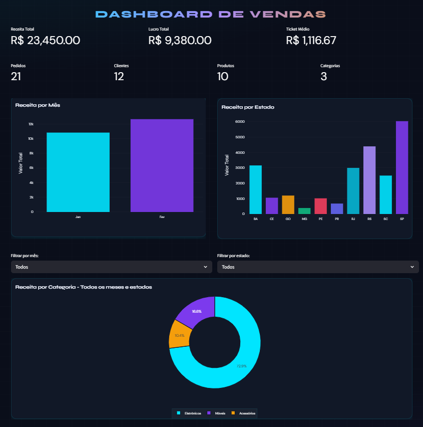

# 📊 Dashboard de Análise de Vendas

> Pipeline de dados completo com ETL, cálculo de KPIs e dashboard interativo construído com Streamlit e Plotly.

---

## 🧩 Sobre o Projeto


Este projeto simula um ambiente real de análise de dados de vendas, cobrindo todas as etapas de um pipeline de dados — desde a leitura de arquivos brutos até a exibição de métricas e gráficos interativos em um dashboard.

Desenvolvido com foco em boas práticas de engenharia de dados, organização modular de código e visualização profissional.

---

## 🚀 Funcionalidades

- ✅ Leitura de dados a partir de arquivos CSV
- ✅ Limpeza e tratamento de dados (duplicatas, nulos, tipos)
- ✅ Integração de múltiplas tabelas via merge (pedidos, produtos, clientes)
- ✅ Criação de variáveis derivadas (valor total, custo, lucro)
- ✅ Cálculo de KPIs de negócio
- ✅ Exportação dos dados processados em CSV
- ✅ Dashboard interativo com filtros por mês e estado

---

## 🗂️ Estrutura do Projeto

```
Projetos-CAF-trens/
│
├── data/
│   ├── raw/                    # Dados brutos de entrada
│   │   ├── clientes.csv
│   │   ├── pedidos.csv
│   │   └── produtos.csv
│   └── processed/              # Dados gerados após o pipeline
│       ├── dados_limpos.csv
│       ├── dados_processados.csv
│       └── dados_integrados.csv
│
├── src/
│   └── analise_vendas/
│       ├── data_loading.py     # Leitura dos CSVs
│       ├── data_cleaning.py    # Limpeza dos dados
│       ├── data_processing.py  # Integração e criação de variáveis
│       ├── analysis.py         # Cálculo de KPIs
│       └── visualization.py   # Dashboard Streamlit + Plotly
│
├── reports/                    # Relatórios gerados
├── build/                      # Executável compilado (PyInstaller)
├── main.py                     # Entry point da aplicação
├── requirements.txt
├── pyptoject.toml
└── build.bat                   # Script de build para Windows
```

---

## 🔄 Pipeline de Dados

```
CSV Brutos → Limpeza → Integração → Variáveis → KPIs → Dashboard
```

**1. Carregamento** — leitura dos arquivos `clientes.csv`, `pedidos.csv` e `produtos.csv`

**2. Limpeza** — remoção de duplicatas, tratamento de nulos e conversão de tipos

**3. Integração** — merge entre pedidos, produtos e clientes em um único DataFrame

**4. Criação de variáveis** — extração de ano/mês/dia e cálculo de `valor_total`, `custo_total` e `lucro`

**5. KPIs** — receita total, lucro total e ticket médio

**6. Dashboard** — visualização interativa com filtros dinâmicos

---

## 📐 Schema dos Dados

| Arquivo | Colunas |
|---|---|
| `clientes.csv` | `cliente_id`, `nome`, `cidade`, `estado` |
| `pedidos.csv` | `pedido_id`, `cliente_id`, `produto_id`, `data_pedido`, `quantidade`, `preco_custo`, `desconto`, `frete` |
| `produtos.csv` | `produto_id`, `nome`, `categoria`, `preco_unitario` |

---

## 📊 KPIs e Gráficos

**Métricas exibidas no dashboard:**

| KPI | Descrição |
|---|---|
| Receita Total | Soma de `quantidade × preco_unitario` |
| Lucro Total | Receita menos custo total |
| Ticket Médio | Receita dividida pelo número de pedidos |
| Pedidos | Quantidade de pedidos únicos |
| Clientes | Clientes distintos |
| Produtos | Produtos distintos |
| Categorias | Categorias de produtos |

**Gráficos:**

- 📅 Receita por Mês (barras)
- 🗺️ Receita por Estado (barras)
- 🍩 Receita por Categoria (donut) — filtrado dinamicamente por mês e estado

---

## 🛠️ Tecnologias Utilizadas

| Tecnologia | Uso |
|---|---|
| Python 3.10+ | Linguagem principal |
| Pandas | Manipulação de dados |
| NumPy | Operações numéricas |
| Streamlit | Interface do dashboard |
| Plotly | Gráficos interativos |
| PyInstaller | Geração de executável |

---

## ▶️ Como Executar

### 1. Clonar o repositório

```bash
git clone https://github.com/Pedrobarberini/Projetos-CAF-trens.git
cd Projetos-CAF-trens
```

### 2. Instalar dependências

```bash
pip install -r requirements.txt
```

### 3. Executar o pipeline e abrir o dashboard

```bash
streamlit run src/main.py
```

> Os dados processados serão salvos automaticamente em `data/processed/`.

### 4. (Opcional) Gerar executável para Windows

```bash
build.bat
```

O executável será gerado em `build/PAV/`.

---

## 📈 Possíveis Melhorias

- [ ] Testes automatizados com `pytest`
- [ ] Integração com banco de dados (PostgreSQL / SQLite)
- [ ] Deploy do dashboard via Streamlit Cloud
- [ ] Análise preditiva de vendas com `scikit-learn`
- [ ] Suporte a múltiplos formatos de entrada (Excel, JSON)
- [ ] CI/CD com GitHub Actions

---

## 👨‍💻 Autor

**Pedro Barberini**

- GitHub: [github.com/Pedrobarberini](https://github.com/Pedrobarberini)
- Portfólio: [pedrobarberini.github.io/Curriculo](https://pedrobarberini.github.io/Curriculo/)

---

> Projeto desenvolvido para fins de aprendizado prático em engenharia e análise de dados com Python.